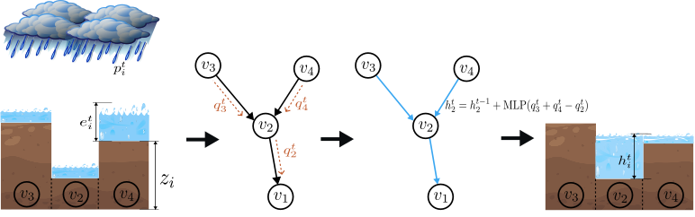

# Pluvial Flood Emulation with Hydraulics-informed Message Passing  

This the code our paper ["Pluvial Flood Emulation with Hydraulics-informed Message Passing"](https://openreview.net/forum?id=kIHIA6Lr0B&noteId=kIHIA6Lr0B) published at ICML 2024

 

 ## Required Packages
* Python 3.8
* [PyTorch](https://pytorch.org/) 1.12
* [PyTorch Geometry](https://pytorch-geometric.readthedocs.io/) 2.2

## Running the Code 
    python train.py 

## Data 
See details about the data format (including conversion between grid and graph representation) in the jupyter notebook [data_exploration.ipynb](./data_exploration.ipynb). The  processed data can be downloaded from [here](https://zenodo.org/records/12425639). 

- Training set 
    > whiteoak_harvey  
    whiteoak_clearlake  
    whiteoak_jul_2018  
    sanjacintoriver_harvey  
    sanjacintoriver_clearlake  
    sanjacintoriver_jul_2018  
    vince_harvey  
    vince_clearlake  
    vince_jul_2018  

- Validation set 
    > hunting_harvey  
        greens_harvey  
        sims_harvey 

## Cite 
    @inproceedings{kazadi2024pluvial,
        title={Pluvial Flood Emulation with Hydraulics-informed Message Passing},
        author={Kazadi, Arnold and Doss-Gollin, James and Silva, Arlei},
        booktitle={ICML},
        year={2024}
    }

